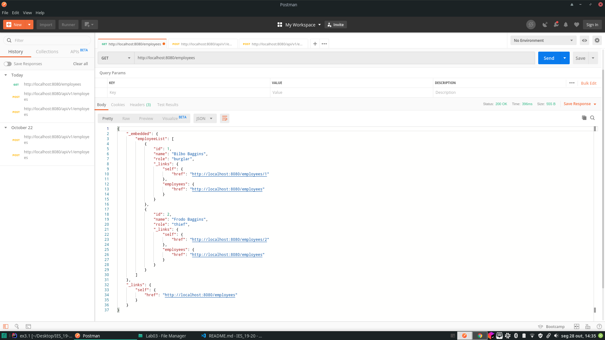
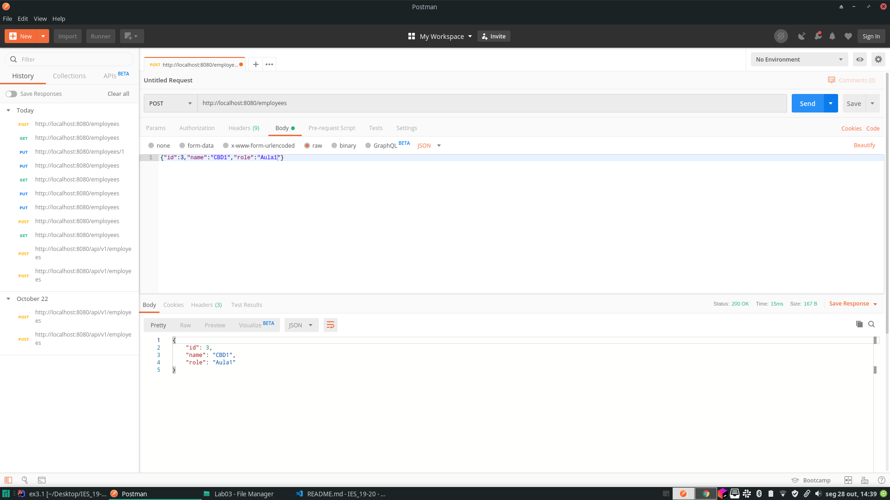
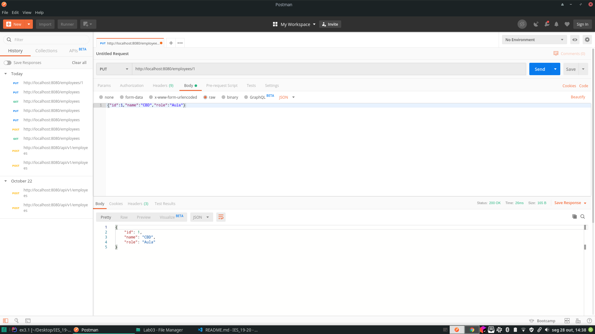

# Multi-layer web applications with Spring Boot
Learning outcomes
* Start a web application with Spring Boot and Spring Initializr, combining the appropriate 
* starter” dependencies.
* Create and persist entities into a relational database using Spring Data. 
* Expose a RESTful API, using Spring Annotations.

## Architectural Diagram

## Test API

* GET Method
 

 
 
* POST Method
 

 
 
* PUT Method
 

## What happens to your data when the application is stopped and restarted? How could you change  that behavior?
A API retorna todos os valores de origem.
A solução para resolver este problema seria separar a base de dados da API.

## Describe the role of the elements modeled in the previous point

## Why is that the Employee entity does not have getters and setters defined? (tip: Lombok)

A entidade `Emplyoee` tem uma anotação `@Data`, esta anotação faz com que o `Lombok` gere os getters e setters de forma automática não sendo necessário escrever os mesmos.

## Explain the annotations @Table, @Colum, @Id found in the Employee entity

## Explain the use of the annotation @AutoWire